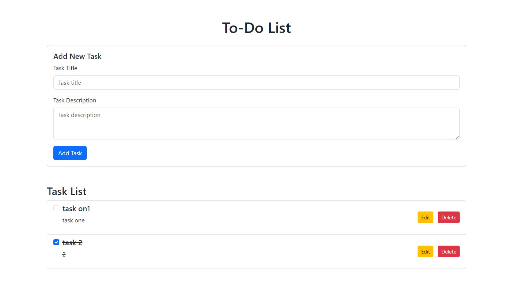

# To-Do List API
This is a simple To-Do List API built using Django and SQLite. The API allows users to create, retrieve, update, and delete to-do items, along with a Bootstrap-based frontend for managing tasks.

## Table of Contents
- [Features](#features)
- [Screenshot](#screenshot)
- [Requirements](#requirements)
- [Installation](#installation)
- [API Endpoints](#api-endpoints)
- [API Response Example](#api-response-example)
- [Frontend](#frontend)
- [Frontend Interactions](#frontend-interactions)
- [Usage](#usage)

## Features
**CRUD Operations**: Create, Read, Update, and Delete to-do items.
**Data Model**: To-do items have a title, description, and completed status.
**REST API**: The API is RESTful and allows interaction with the to-do items.
**Frontend**: A simple Bootstrap-based frontend to interact with the API.

## Screenshot


## Requirements
- Python 3
- Django 5.1.1
- SQLite (default database for Django)

## Installation
Follow these steps to get the project running on your local machine.
1. **Clone the Repository**
    ```bash
    git clone https://github.com/aslammiya/todo-rest-api
    cd todo-rest-api
    ```

2. **Set up a virtual environment:**
    ```bash 
    python -m venv env
    ```

3. **Activate Virtual Environment**

   **On macOS/Linux:**
     ```bash
     source env/bin/activate
     ```
   **On Windows:**
     ```cmd
     .\env\Scripts\activate
     ```

4. **Install Dependencies**
    ```bash
    pip install -r requirements.txt
    ```
5. **Run migrations to set up the database:**
    ```
    python manage.py migrate
    ```
6. **Run the development server:**
    ```
    python manage.py runserver
    ```
7. **Access the frontend**: Visit `http://127.0.0.1:8000/` in your browser to view the To-Do List frontend.

## API Endpoints
The following RESTful API endpoints are available:

- GET /api/todos/

    Retrieves a list of all to-do items.

- POST /api/todos/

    Creates a new to-do item. Example JSON payload:

    ```json
    {
    "title": "New Task",
    "description": "Task description",
    "completed": false
    }
    ```

- PUT /api/todos/<id>/

    Updates an existing to-do item. Example JSON payload:
    ```json
    {
    "title": "Updated Task",
    "description": "Updated description",
    "completed": true
    }
    ```
- DELETE /api/todos/<id>/

    Deletes an existing to-do item.

## API Response Example
A typical response from `GET /api/todos/`:

```json
[
  {
    "id": 1,
    "title": "Buy groceries",
    "description": "Milk, Bread, Eggs",
    "completed": false
  },
  {
    "id": 2,
    "title": "Finish project",
    "description": "Complete Django project",
    "completed": true
  }
]
```

## Frontend
The frontend is built with Bootstrap for a responsive interface. It provides:

- A form to create new to-do items.
- A list of to-do items with the ability to edit or delete them.
- A checkbox to mark tasks as completed.

## Frontend Interactions

- **Add a Task**: Fill in the form and click "Add Task" to create a new to-do.
- **Edit a Task**: Click the "Edit" button to modify a task.
- **Delete a Task**: Click the "Delete" button to remove a task.
- **Mark as Completed**: Check the box to mark a task as completed.

## Usage
**Run Locally**: After setting up, run python manage.py runserver and visit http://127.0.0.1:8000/.

**Test the API**: Use Postman or cURL to interact with the API endpoints.asgiref==3.8.1
